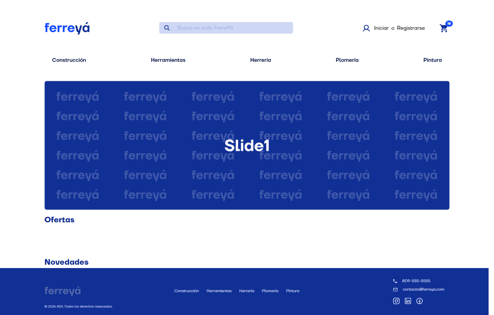

# FerreYá
E-commerce para una ferretería como proyecto final para el curso de ReactJS en CoderHouse.

# Screens
## Pre-entrega 1

## Build with
- Vite
- React
- Tailwind

## Info cursada
- Comisión 72745
- Profesor: Pablo Martín Rovira
- Tutor: Juan Manuel Chico